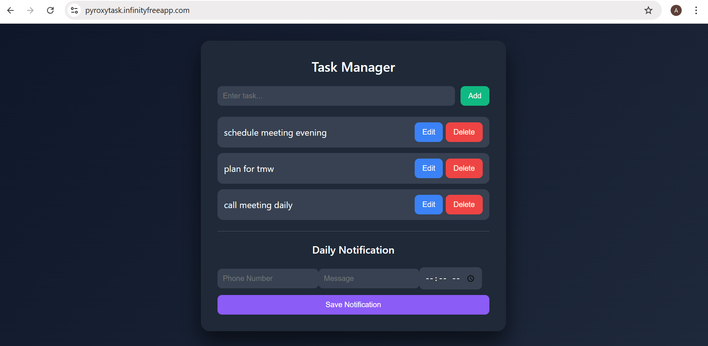

# Pyrox Task Manager – Full Stack CRUD Application

## Live Deployment

🔗 https://pyroxytask.infinityfreeapp.com/

---

## Project Overview

This is a full-stack Task Management Web Application built using:

- **Frontend:** React (Vite)
- **Backend:** PHP (REST APIs)
- **Database:** MySQL
- **Notification Service:** Twilio WhatsApp API
- **Hosting:** InfinityFree

The application supports full CRUD operations and includes an automated daily WhatsApp notification system.

---

## Features

Add Tasks  
 View Tasks  
 Update Tasks  
 Delete Tasks  
 Store Data in MySQL Database  
 Daily WhatsApp Notification System

---

## Project Structure

```
pyrox-task-project/
│
├── frontend/      # React source code
├── backend/       # PHP API files
├── database/      # SQL file for database setup
└── README.md
```

---

## Tech Stack

- React (Vite)
- PHP
- MySQL
- Twilio WhatsApp API
- InfinityFree Hosting

---

## Setup Instructions (Local)

### 1️⃣ Database Setup

- Import `database/task_db.sql` into MySQL.
- Update database credentials inside `backend/db.php`.

### 2️⃣ Twilio Setup

- Create a Twilio account.
- Enable WhatsApp Sandbox.
- Replace credentials inside `send_notification.php`:

```php
$account_sid = "YOUR_TWILIO_ACCOUNT_SID";
$auth_token  = "YOUR_TWILIO_AUTH_TOKEN";

```
## Project Screenshot



