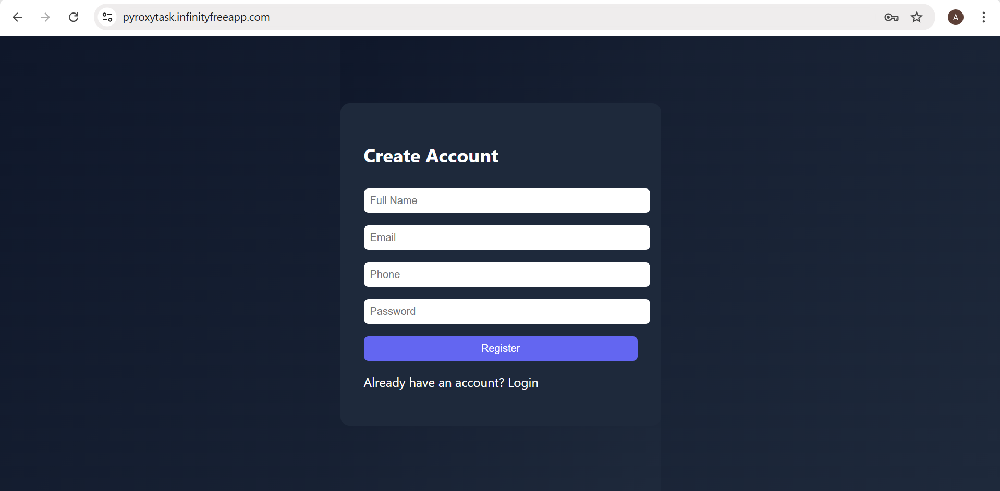
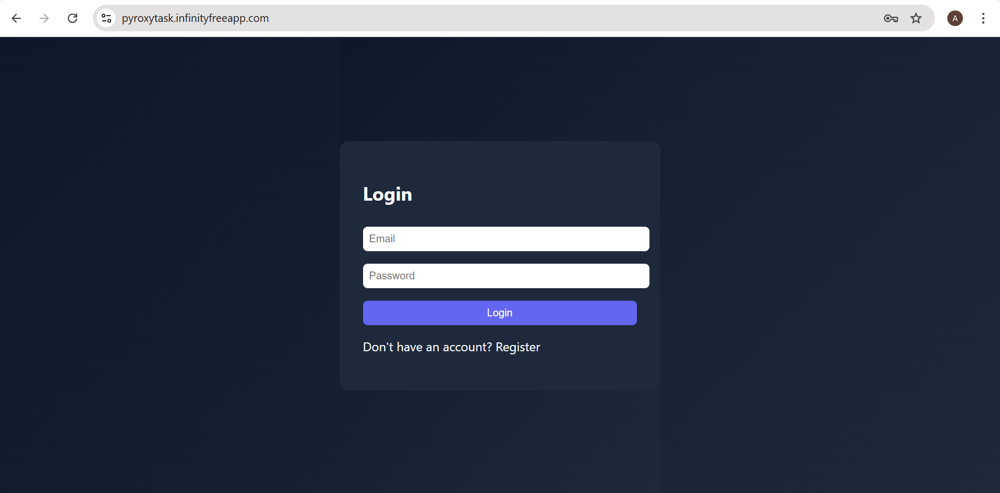
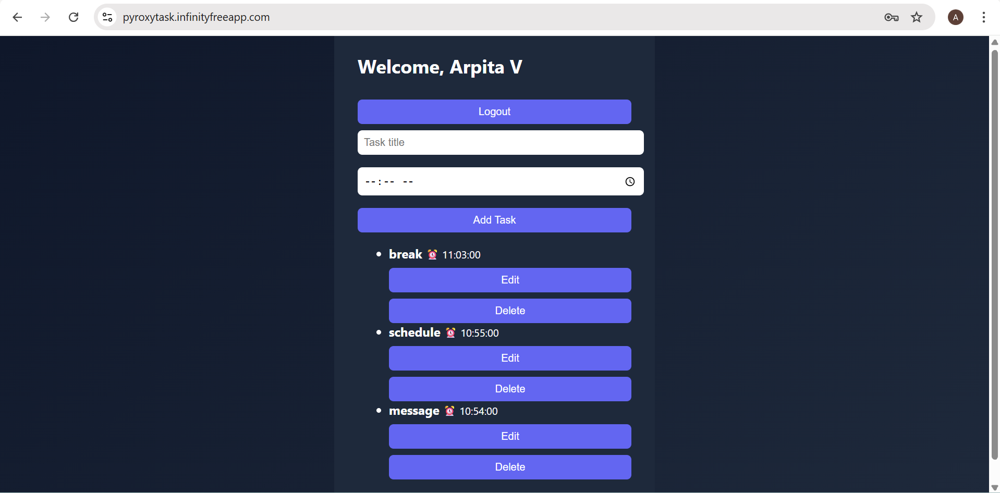

# Pyrox Task Manager with WhatsApp Reminder

A full-stack Task Management application built using **React, PHP, MySQL**, and **Twilio WhatsApp API**.

This project supports complete CRUD operations and sends automated WhatsApp reminders using a Cron job.

---

## Live Project

🔗 https://pyroxytask.infinityfreeapp.com/

---

## Tech Stack

### Frontend

- React (Vite)
- Custom CSS (Dark Theme)

### Backend

- PHP (REST APIs)
- MySQL Database
- cURL (Twilio API integration)

### External Services

- Twilio WhatsApp Sandbox
- Cron-job.org (for automated scheduling)

---

## Features

- 🔐 User Registration & Login (Password Hashing)
- 📋 Create, Read, Update, Delete Tasks
- ⏰ Set Reminder Time for Tasks
- 📱 WhatsApp Reminder Notification
- 🔁 Cron Job Automation (runs every minute)

---

## Project Structure

```
pyrox-task-project/
│
├── frontend/        # React source code
├── backend/         # PHP API files
├── database/        # SQL file for setup
└── README.md
```

---

## Database Setup

Import the SQL file inside the `database/` folder.

Required tables:

- users
- tasks
- notifications

---

## Twilio Setup

1. Create a Twilio account
2. Enable WhatsApp Sandbox
3. Join sandbox using WhatsApp:

   ```
   join personal-feature
   ```

   Send to:

   ```
   +14155238886
   ```

4. Add your credentials inside:
   `send_notification.php`

   ```
   $account_sid = "YOUR_ACCOUNT_SID";
   $auth_token  = "YOUR_AUTH_TOKEN";
   ```

---

## Cron Job Setup

1. Go to https://cron-job.org
2. Create free account
3. Add new cron job with URL:

```
https://pyroxytask.infinityfreeapp.com/send_notification.php
```

4. Set interval to:

```
Every 1 minute
```

Now reminders will run automatically.

---

## How It Works

1. User registers / logs in
2. User creates task with reminder time
3. Task saved in `tasks` table
4. Reminder saved in `notifications` table
5. Cron job runs every minute
6. If time matches → Twilio sends WhatsApp message

---

## Security Features

- Passwords hashed using `password_hash()`
- Password verified using `password_verify()`
- Prepared statements used for database queries
- CORS enabled for frontend-backend communication

---

## Important Notes

- Twilio Trial account sends messages only to verified numbers.
- Server timezone set to `Asia/Kolkata`.
- Reminder time must match server time.

---

## 👩‍💻 Developed By

Arpita V

---

## Project Status

✅ CRUD Completed  
✅ Authentication Working  
✅ WhatsApp Reminder Working  
✅ Cron Automation Working  
✅ Hosted Online

---

## Screenshots

### Login Page




### 📋 Dashboard


